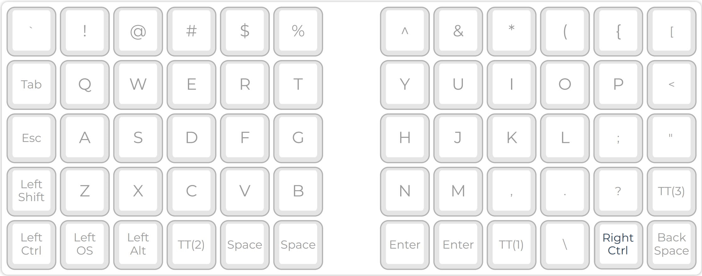
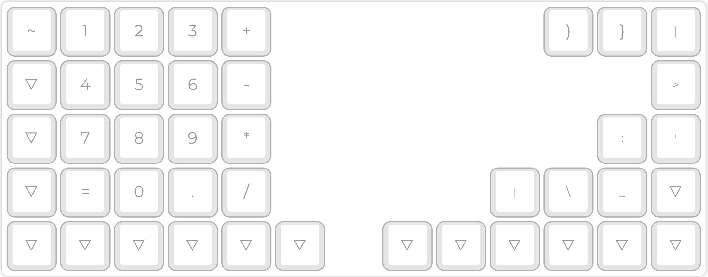
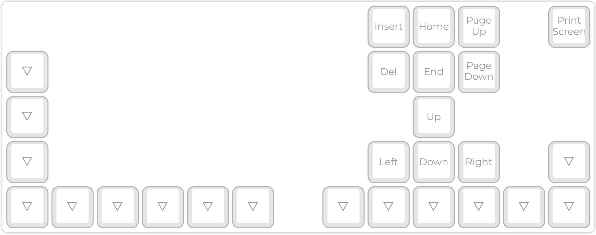

# Reasoning behind **Qibord**

## General notes

It would be nice to have a split keyboard. Previously I thought that a TKL keyboard would be nice, but while fiddling with possible layout, it turned out TKL has too many keys. A 60%/65% keyboard however fits the desired UX just right.

It would be nice to have **MOD** keys, kind of like in [vim](vim.org). **MOD** key basically switches between layers, just like **CTRL**, **ALT**, **SHIFT**, and so on. Each layer allows us to encode a desired layout and behavior. It would be nice to keep the **MOD** keys far from each other, so I won't press the wrong key by mistake.

**MOD** keys can be sticky and not-sticky, not sure which to use yet.

[This](qibord_layout.json) is the layout file (at least the draft of it).

## Layers

After some tests (w/o the keyboard) I decided that 4 layers will be enough.

Those layers are described below.

### Key legend

 is the key responsible for switching to the specified layer. In this particular image, it will switch to [layer 1](#numpad-and-the-rest-of-the-symbols-layer-layer-1).

 means that if the key has no bindings on the current layer, it will act as the first next *non-transparent* key on layers below. This means that the lower-leftmost key on [layer 2](#text-navigation-layer-layer-2) will act as **Left Ctrl**. Generally, _all control keys_ are set on [layer 1](#key-size) and referenced like so from other layers.

### Default Layer

By default layer, I mean the layer that is active when no layer toggle keys are pressed. It contains the alphas and the _unshifted_ symbols. As you can see, the numerals and _shifted_ keys are not here. The **SHIFT** key on this layer is used only to capitalize letters. This is the only responsibility of **SHIFT** key on _Qibord_.

Other uses of the **SHIFT** key were bound to layer keys. You may notice that on this layer, only the opening brackets are present, which allows me to type them in one keystroke. Their counterparts are situated on the next layer. The same goes for the symbols on the vertical numeral keys.

It turns out that I don't use **CAPS LOCK** at all, so it is replaced on the default layout by a [_1U_](#key-size) **ESC** key.

I also rarely use the whole length of **SPACE** _6.25U_ key. [Nyquist](https://keeb.io/collections/split-keyboard-parts/products/nyquist-keyboard) allows for four _2U_ keys: one on the left and right ends of the lowest row on both plates. Having a _2U_ **SPACE** key on the lower right corner of the left plate, right under the left thumb seems to do the job just great. Again, this has to be tested when the keyboard is assembled.

I also decided to move the **ENTER** and **BACKSPACE** keys. **ENTER** will be _2U_ key, placed on the lower left of the right plate, under the right thumb. **BACKSPACE** will be _2U_ key, placed on the lower right of the right plate, under the right pinky. Doing this creates a nice space for all the _main_ symbols on the upper-right/right of the plate.

Control keys are lined up on the lowest row of both plates and the leftmost column of the left plate. The idea is to press them with pinkies and thumbs. This seems to be convenient, at least for now.

Another thing I noticed is I almost never use the right shift key on any of my current (full)keyboards, so decided not to have it on Qibord.

The keys **TT(1)**, **TT(2)** and **TT(3)** are the **MOD** keys that switch between layers [1](#numpad-and-the-rest-of-the-symbols-layer-layer-1), [2](#text-navigation-layer-layer-2) and [3](#fn-and-media-layer-layer-3) correspondingly.

Below is a possible layout of the layer.

### Numpad and the rest of the symbols layer (layer 1)

This layer contains the digits and missing symbols from the default layer. Again, I don't want to use the **SHIFT** key for switching between the symbols. I also do not like typing in the numbers using the horizontal keys, it's too much movement. One more thing I want to try is a mapping of symbols different from **SHIFT** one. It seems to me that it is more intuitive to map the opening and closing braces to the same key and switch via a ****MOD**** key. Using a custom **MOD** key also allows us to move the keys I use a lot such as `"`, `{` or `(` via **SHIFT**-ing to the default layout.

All this is good, but this does not mean that the _generic_ keyboard layout is complete rubbish, and it would be good to preserve such conveniences. I noticed, for example, that I broke one such key pair - the `./`. Luckily, it was easy to fix. You can see that the `.` and `/` are next to each other on the left handside on this layer. I noticed this by luck and have no idea what other such combinations I broke. I think they'll manifest themselves during coding, once the keyboard is built.

Digits on numpad resemble a phone dialer, since, again, it is more intuitive to me.

Below is a possible layout of the layer.

### Text navigation layer (layer 2)

This layer is fairly simple. For now, it utilizes only the right plate and replicates the **INSERT**, **DEL**, **HOME**, **END**, **PAGE UP**, **PAGE DOWN** and ***-ARROW** keys as they would be positioned on full keyboards. Unlike [_vim_](vim.org)-s approach of mapping 2D directions to the 1D physical order of **H**, **J**, **K**, and **L**, this should enable a 2D navigation with index, middle and ring fingers, which is what I like.

It also contains the **PRINT SCREEN** key, since I use it and can not think of a reasonable place to put it, so it will stay here for now.

Below is a possible layout of the layer.

### Function and Media layer (layer 3)

This layer contains the **F1** to **F12** keys, placed on the top row of both plates. It fits nicely and does not clutter a single plate. This layer also contains three media keys: **MUTE**, **VOL-**, and **VOL+**. They are here since they do not _deserve_ a separate layer and to me are closer to function keys rather than to text navigation.

Below is a possible layout of the layer.

**NOTE:** Note how all control keys are on the default layer and are not overridden on other layers. This allows us to use multiple key combinations such as **CTRL+ALT+[*]**, **CTRL+SHIFT+ALT+[*]**, and so on.

## Hardware

### Current choice

I decided to go with [Nyquist/Levinson (Rev. 3)](https://keeb.io/collections/split-keyboard-parts/products/nyquist-keyboard) - an ortholinear 60%/40% split keyboard. I will be using all 60% of it - two 5x6 plates.

### Older considerations

The boards below have too many keys.

[KBO-5000](https://keeb.io/collections/frontpage/products/kbo-5000-split-staggered-80-keyboard) 80% keyboard seems to be a nice place to start.

[BFO-9000](https://keeb.io/collections/frontpage/products/bfo-9000-keyboard-customizable-full-size-split-ortholinear) is another option but I do not see how to assemble it yet.

----------

## Notes

### Key size

_1U_ measures a center-to-center spacing of about 19mm. For more info, refer to [this](https://www.reddit.com/r/MechanicalKeyboards/wiki/keycap_guides#wiki_key_spacing) post.
