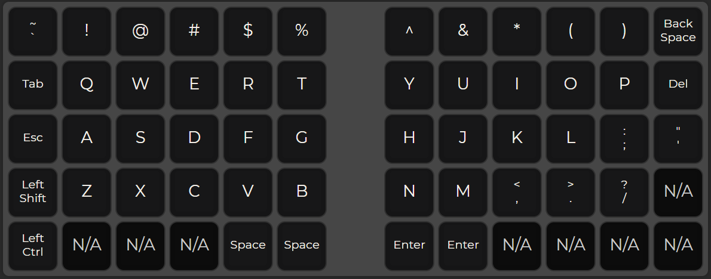

# Notes

## General notes

It would be nice to have a split keyboard. Previously I thought that a TKL keuboard would be nice, but while fiddling with possible layout, it turned out TKL has too many keys. A 60%/65% keyboard however fits the desired UX just right.

It would be nice to have MOD keys, kind of like in [vim](vim.org).

I, J, K, L keys on the right half can be used to simulate arrow keys via a MOD key. The mod key for this probably will be situated on the left handside.

| Keys   | I | J | K | L |
|:-------|:-:|:-:|:-:|:-:|
| Arrows | ↑ | ← | ↓ | → |

Another MOD key can be used transition to NUMPAD mode. I think it would be best to locate the NUMPAD on the right handside and the MOD key on the left. This MOD key is effectively the NUM LOCK but, noy sticky. Below is one such possible mapping (w/o MOD key):

| Keys   | Q | W | E | A | S | D | Z | X | C | R |
|:-------|:-:|:-:|:-:|:-:|:-:|:-:|:-:|:-:|:-:|:-:|
| Digits | 1 | 2 | 3 | 4 | 5 | 6 | 7 | 8 | 9 | 0 |

The CAPSLOCK key is not needed. It could serve as an ESC key.

I rarely use the whole length of SPACE key. Having a SPACE key on left handside should probably be enough. The right handside SPACE could serve as a RETURN key.

Another thing I noticed is I almost never use the right shift key on my current (full)keyboards.

I also need a Fn MOD key.

MOD keys can be sticky and not-sticky.

[This](qibord_layout.json) is the layout file (at least the draft of it).

## Layers

### Layer 1

Below is a possible layout of layer 1

## Hardware

### Current choice

I decided to go with [Nyquist/Levinson (Rev. 3)](https://keeb.io/collections/split-keyboard-parts/products/nyquist-keyboard) - an ortholinear 60%/40% split keyboard.

### Older considerations

[KBO-5000](https://keeb.io/collections/frontpage/products/kbo-5000-split-staggered-80-keyboard) 80% keyboard seems to be a nice place to start.

[BFO-9000](https://keeb.io/collections/frontpage/products/bfo-9000-keyboard-customizable-full-size-split-ortholinear) is another option but I do not see how to assemble it yet.
