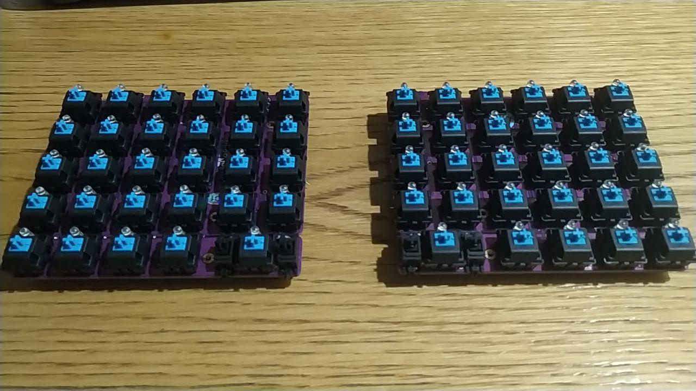

# Notes

I have all the parts now. It turns out that I mis(read/interpreted) the [Keebio Nyquist docs](https://keeb.io/collections/split-keyboard-parts/products/nyquist-keyboard) docs and there are only two _2U_ keys, one on the lower inner corner of the plate, so the **BACKSPACE** key, as it is designed now, has to go.

Here is how it looks now, assembled but unsoldered and w/o firmware:

Qibord front

and back

