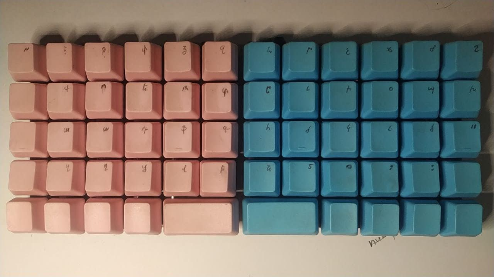
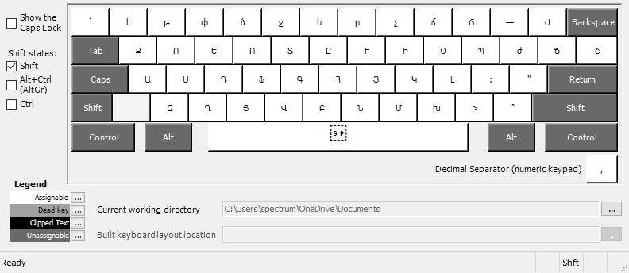

# Notes

I decided on the Armenian layout for qibord v1. It is mostly the Armenian phonetic layout for windows, but with some tweaks, due to the _qibord v1_ specifics:

Here's how it looks in [MSKLC](https://msklc-guide.github.io/):

And with the **SHIFT** pressed:

As you can see in the first MSKLC image /the default view/, I am missing the letters on the top row. This is because keyboards work in certain ways and the Armenian letter _`է` `[ɛ]`_ is bound to the ASCII code of `1` and not to a physical key. Since _qibords_ miss the top number line, all the symbols associated with them were moved to their corresponding **SHIFT**-ed keys, which happens to be the top row of _qibord_.

This solves for having all the lowercase letters paying the price of not having the following uppercase letters `Է,Թ,Փ,Ձ,Ջ,Ր,Չ`. Special symbols were moved to the lower end of the right pad.

You can find the layout installer for Windows [here](../../layouts/v1.1/armenian/qibord-v1.klc). I do not know when I will create one for a linux, sorry.
