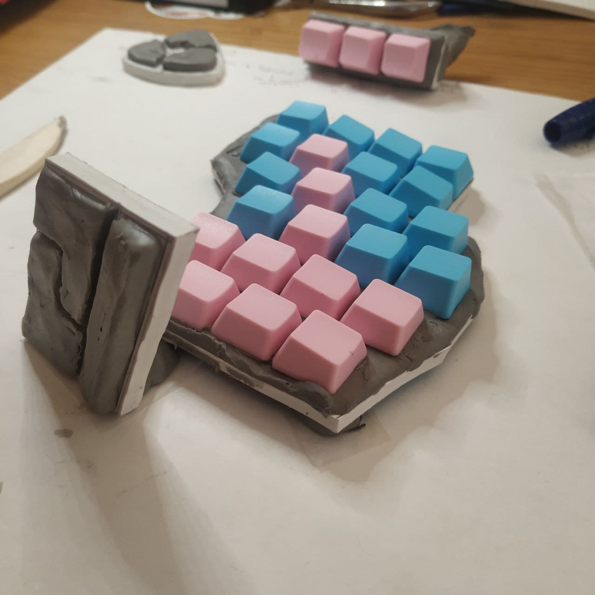
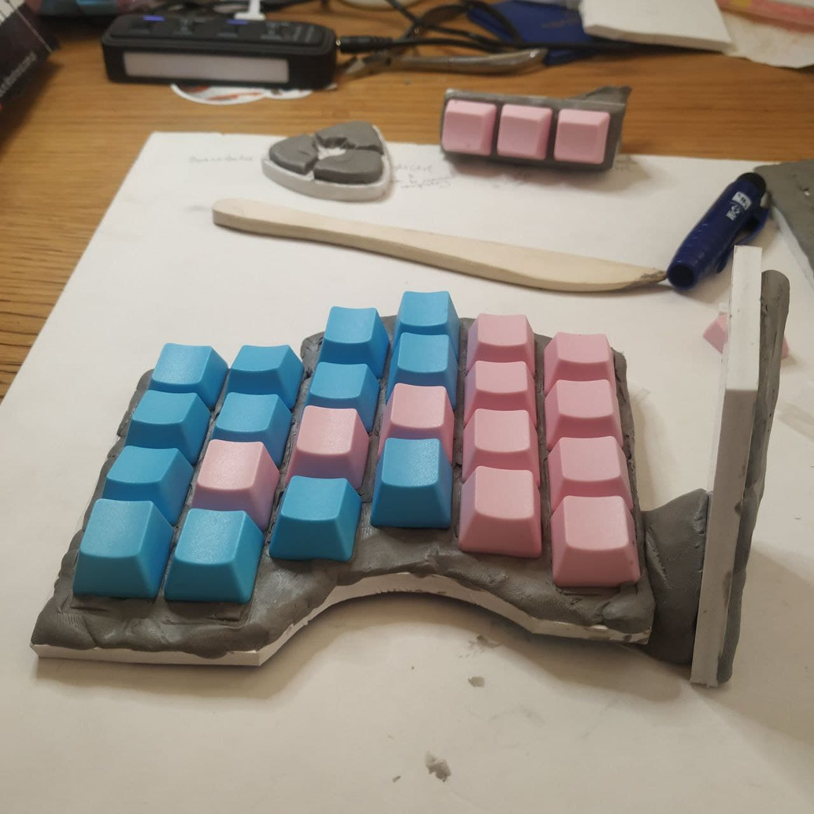
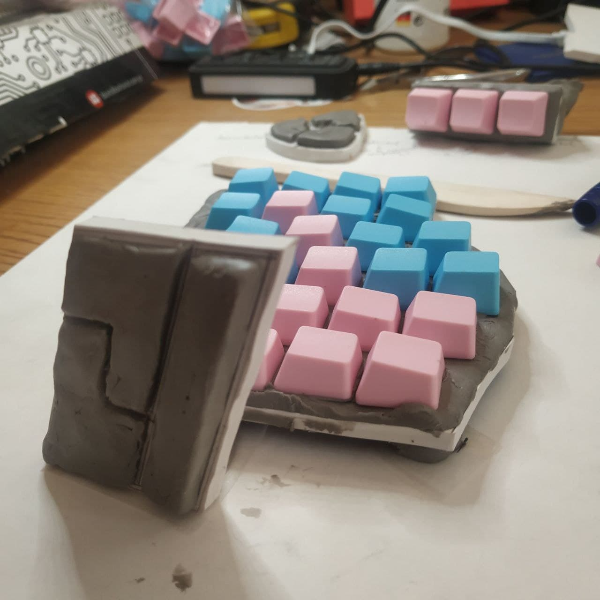
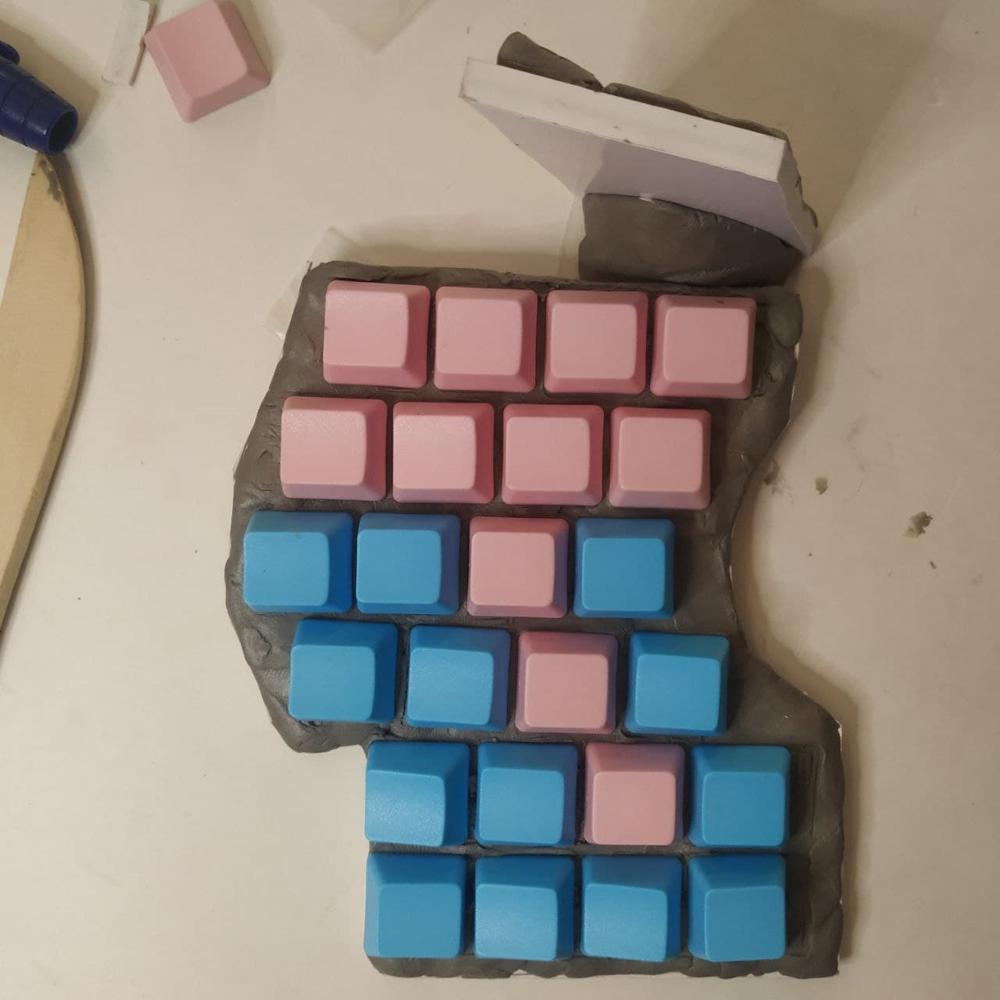
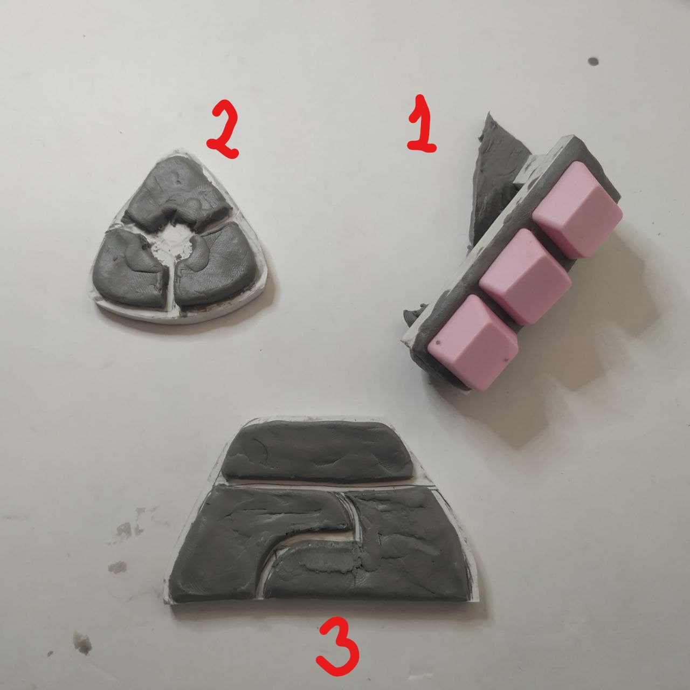

# Notes

Here's where we are standing with _qibord 2_.

There has been some good progress on the thumbpad. With plastiline and some spare keycaps, I came up with something like this.

## The thumbpad

The thumbpad is vertical to the main pad and very slightly tilted, so it won't get in the way of the index finger pressing the lowest right key. It also considers the easy accessibility of the far keys (top-left).

Here are the rear, side, and top views.

Here are the other designs I came up with.

The thumbpad contains **ALT**, **CTRL**, and **TT(1)** keys and the idea is to be able to press all of them separately, pairwise, and altogether in a comfortable way. I started with **1** and the intent was to align the keys in the same direction with the thumb but that was not working when we had to press the endmost keys. Option **2** was a mindless effort and **3** seemed to be a step in the right direction.

Eventually, the rhombus won. It aligns the keys vertically to the thumb and has three sections split between two keys, which allows pressing key pairs and all the keys together conveniently. The distance and the tilt angles may change over time but overall I am happy with the design. It is larger than I'd like it to be but the layout seems solid.

The bottom key is **CTRL**, the top key is **ALT** and **TT(1)** is the long vertical one. **TT(1)** cap should probably be a bit higher than the others and with a slope for easier reach.

Since the right pads are the mirrored versions of the left ones, I did not mock them and probably will never do. Next, I plan to work on the circuitry.
