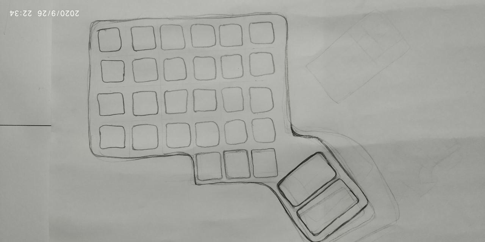
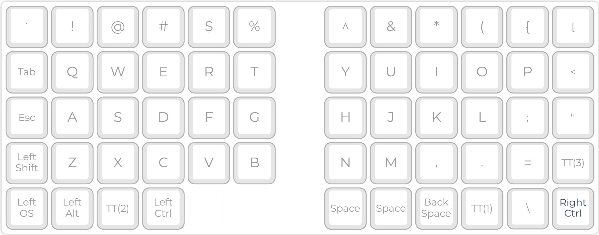
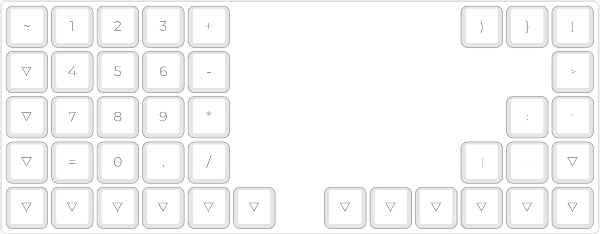

# Notes

It has been about a month since I started using the _qibord_ and a few design flaws start to show up already.

I am still slower than on a regular keyboard but the overall ergonomics of it is awesome. I am not using it much since my Armenian layout is off and I have to switch to the old keyboard quite often, which is not that comfortable. I still use it daily thou. Here are some of the things that will be changed with the next major release.

## Thumb motions are strained

_qibord_ heavily relies on the thumb but with the current version, the motion of the thumb is mighty uncomfortable. The movement of the thumb is directed inwards right under the palm, which is hard. The outward motion, that is much easier, is not present at all. For the next version I plan to shift the keys on the lowest line towards each other and curve down so they can still be pressed by thumbs but via the outwards motion. The shape of it should roughly look something like this:

## The keys definitely need to be lubed

They do, since currently you can feel too much mechanical resistance, which makes the key presses too cranky. This is not the key press experience, we have been fighting for!

## The layout

As I use the _qibord_, I get a better understanding of what keys need to be where. The layout has undergone one major update so far, and is available as [v1.1](../layouts/v1.1/layout.pdf).

Two layers have been modified, along with the lowest rows on both sides.

### The default layer

I have moved the `=` key to the default row since it is impossible to comfortably code when the key has to be accessed via a **MOD** key. It replaced the `?` key, and the `?` key moved to the **NUMPAD** layer.

Now it looks like this:

### The **NUMPAD** layer

The numbers on this layer have been moved one column to the left so to create a 'safe area' between the number keys and the control column on the very left of the left plate.

Now the layer looks like this:

### The command rows

The lowest rows have been reorganized to move the most used keys closer to thumbs.
